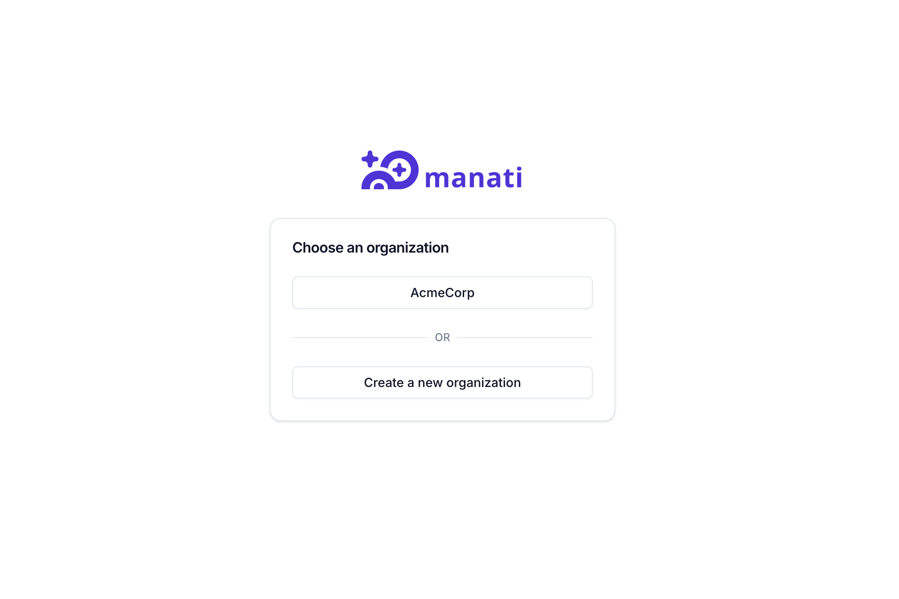
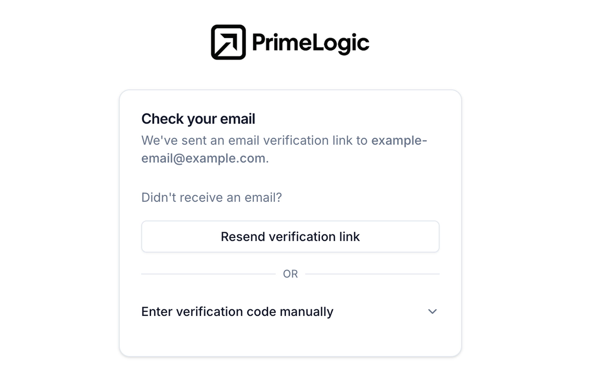
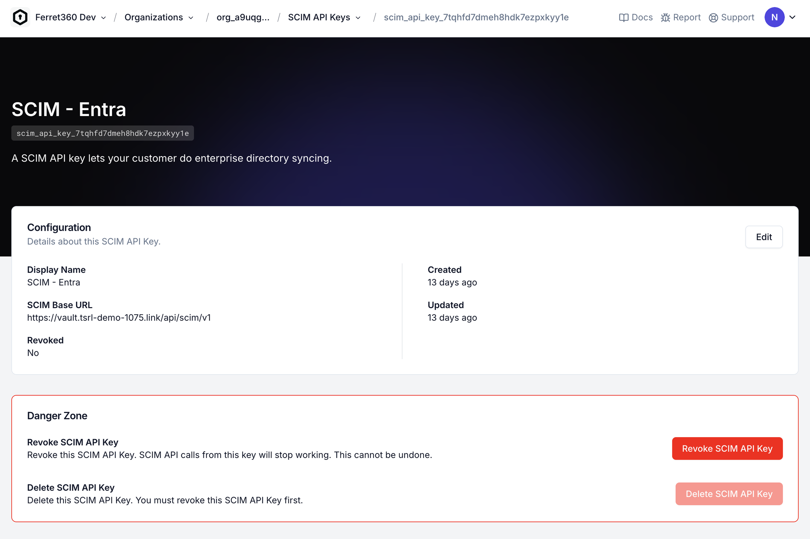
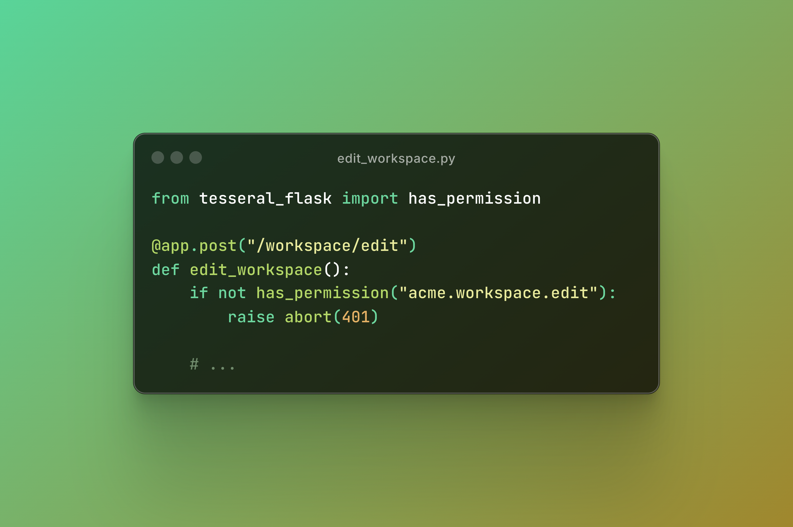
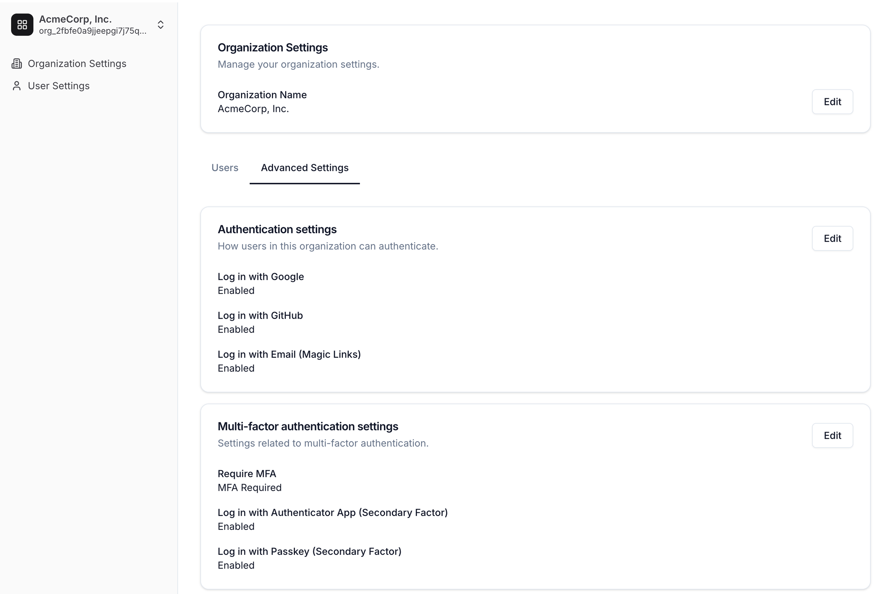

# Tesseral

Tesseral is **open source auth infrastructure for business software** (i.e., B2B
SaaS).

Tesseral is a multi-tenant, API-first service designed to run on the cloud. It
is not an authentication library tied to a particular language or framework;
Tesseral works with any tech stack.

Most developers should start by using Tesseral's managed service, available at
[console.tesseral.com](https://console.tesseral.com). You can also [self-host
Tesseral](https://tesseral.com/docs/features/self-hosting-tesseral).

## Key Features

Tesseral bundles everything that a developer needs to manage users in business software. 

|                                                           |                                                                       |
|-----------------------------------------------------------|-----------------------------------------------------------------------|
| Hosted, customizable login pages                          |  |
| B2B multitenancy                                          |           |
| Session management                                        |         |
| Magic Links                                               |                |
| Social login (e.g., Login with Google, Login with GitHub) |               |
| Enterprise single sign-on (SAML SSO)                      |                       |
| Directory provisioning (SCIM)                             |                       |
| Role-based access control (RBAC)                          |                       |
| Multi-factor authentication (MFA)                         |                        |
| Passkeys (WebAuthn)                                       |                   |
| Authenticator apps (TOTPs)                                |                       |
| API key management                                        |                   |
| User impersonation                                        |                |
| User invitations                                          |                    |
| Self-service config for your customers                    |                 |
| Webhooks (CDC)                                            |                   |

## Get Started

### Read the documentation

We encourage all developers to read the full documentation first, which is
available at tesseral.com/docs. This README provides only a very brief subset of
the docs to illustrate some basic ideas.

### SDKs

Tesseral currently offers several SDKs for common web development frameworks.

* Clientside SDKs
  * [React](https://tesseral.com/docs/sdks/clientside-sdks/tesseral-sdk-react)
* Serverside SDKs
  * [Express](https://tesseral.com/docs/sdks/serverside-sdks/tesseral-sdk-express)
  * [Flask](https://tesseral.com/docs/sdks/serverside-sdks/tesseral-sdk-flask)
  * [Golang](https://tesseral.com/docs/sdks/serverside-sdks/tesseral-sdk-go)

More SDKs, in particular Next.js, are in active development. If you do not see
your preferred framework listed here, please get in touch with
support@tesseral.com; we may be able to give you early access.

### Sign up

For Tesseral’s managed service, you will first need to create an account at
https://console.tesseral.com. 

You will need to create a Project and generate a Publishable Key that looks like
this: `publishable_key_...`.

### Integrate your frontend

To integrate Tesseral into your app, you'll first need to integrate your
frontend. This example uses the [Tesseral React
SDK](https://tesseral.com/docs/sdks/clientside-sdks/tesseral-sdk-react).

Install the SDK like this:

```
npm install @tesseral/tesseral-react
```

Then, using your Publishable Key (starts with `publishable_key_...`), wrap your
React app in the `<TesseralProvider>` component:

```tsx
import { createRoot } from "react-dom/client"
import { TesseralProvider } from "@tesseral/tesseral-react";
import App from "./App.tsx"

const root = createRoot(document.getElementById("root")) 
root.render(
  // use your Project's Publishable Key here
  <TesseralProvider publishableKey="publishable_key_...">
    <App />
  </TesseralProvider>
)
```

The `<TesseralProvider>` will handle a variety of auth-related tasks for you,
including:

* Redirecting unauthenticated users to the login page ("login gating")
* Refreshing users' access tokens in the background when they're close to
  expiring 
* Automatically including access tokens in requests from your frontend
  to your backend

### Integrate your backend

Once you have your frontend integrated with Tesseral, you'll then need to
integrate your backend.

Tesseral works with any backend or framework. SDKs are available for the
following:

* [Express](https://tesseral.com/docs/sdks/serverside-sdks/tesseral-sdk-express)
* [Flask](https://tesseral.com/docs/sdks/serverside-sdks/tesseral-sdk-flask)
* [Golang](https://tesseral.com/docs/sdks/serverside-sdks/tesseral-sdk-go)

Your app might look something like this example, using the [Flask
SDK](https://tesseral.com/docs/sdks/serverside-sdks/tesseral-sdk-flask):

```python
from flask import Flask
from tesseral_flask import access_token_claims, require_auth


app = Flask(__name__)

# use the same Publishable Key you used for your frontend
app.before_request(require_auth(publishable_key="publishable_key_..."))


@app.route("/api/hello", methods=["GET"])
def hello():
    # get the user's email from the current request
    # Tesseral ensures that user emails are always verified
    email = access_token_claims().user.email
    return ("hello, " + email)


if __name__ == "__main__":
    app.run(debug=True, port=5050)
```

Tesseral's `require_auth()` middleware (or its equivalent in your framework's
SDK) validates access tokens for you, and only authenticated requests will go
through to your endpoint handlers. A client can successfully `GET /api/hello` if
and only if it has a valid Tesseral access token.

You can extract out details about the requester using:

* [`organization_id()`](https://tesseral.com/docs/sdks/serverside-sdks/tesseral-sdk-flask#getting-the-current-organization)
* [`credentials()`](https://tesseral.com/docs/sdks/serverside-sdks/tesseral-sdk-flask#getting-the-requests-authenticated-credentials)
* [`access_token_claims()`](https://tesseral.com/docs/sdks/serverside-sdks/tesseral-sdk-flask#getting-details-about-the-current-user)
* [`has_permission()`](https://tesseral.com/docs/features/role-based-access-control#permission-checks)

Or their equivalent in your framework's SDK.

Once you have your backend integrated, you have implemented Tesseral!

## License

[MIT](./LICENSE).

## Contributing

We welcome outside contributions!

Please be aware, however, that auth software is complex and extremely delicate.
We are very cautious with the changes that we merge. We recommend you first open
a GitHub issue outlining any proposed changes.

## Security 

Please immediately report any potential vulnerabilities to
security@tesseral.com. We will get back to you over email.

Please do not open GitHub issues for any security-related concerns.

## Community

We love enterprise software and the people building it.

Please join our community and stay up to date on new releases, events, and other
Tesseral news by following us on
[LinkedIn](https://www.linkedin.com/company/tesseral) and on [X
(Twitter)](https://x.com/tesseralhq). You can also check out our
[newsletter](https://newsletter.tesseral.com/) and our
[blog](https://tesseral.com/blog).

You should also feel welcome to get in touch at founders@tesseral.com with
questions.

## Who we are

This is commercial open source software managed by Tesseral, a startup based in
San Francisco. We previously built
[SSOReady](https://github.com/ssoready/ssoready), an open source middleware for
SAML SSO and SCIM provisioning.

Primary technical responsibility for Tesseral belongs to [Ulysse
Carion](https://ucarion.com/), cofounder and CTO at Tesseral, and to Tesseral's
technical staff: [Blake Williams](https://github.com/blakeofwilliam) and [Dillon
Nys](https://github.com/dnys1).
