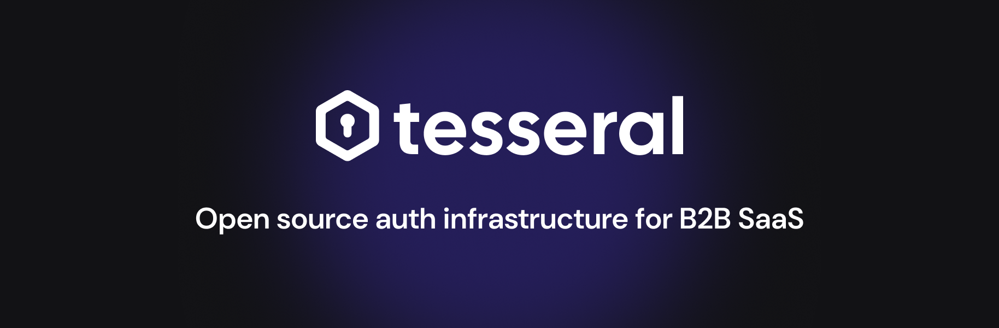
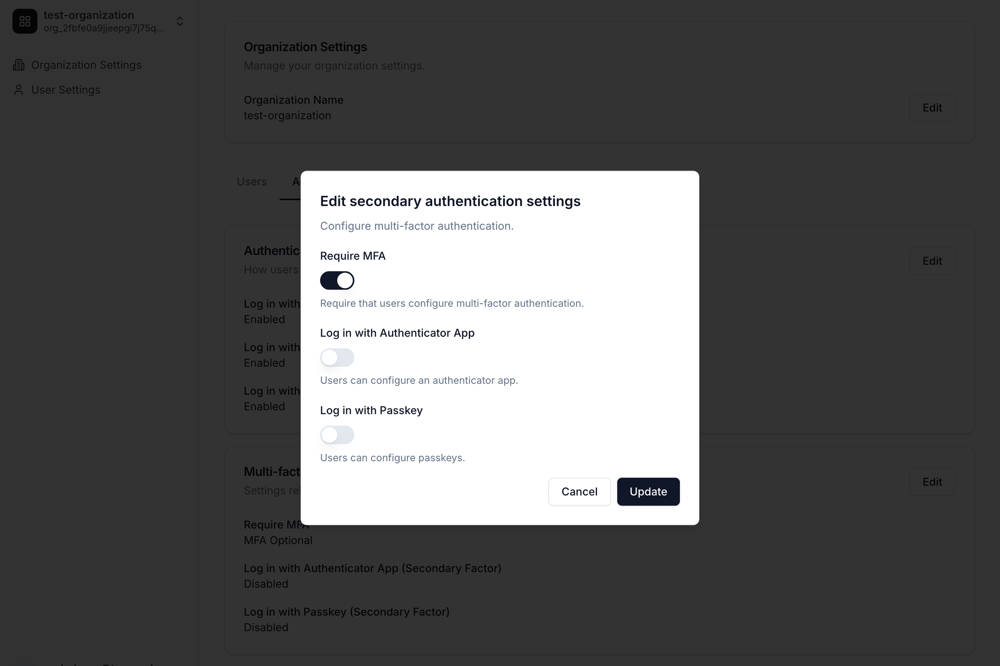
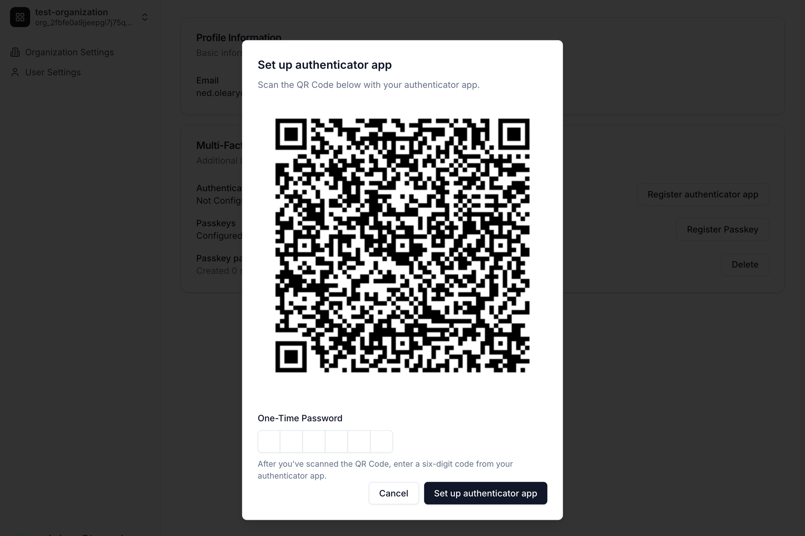
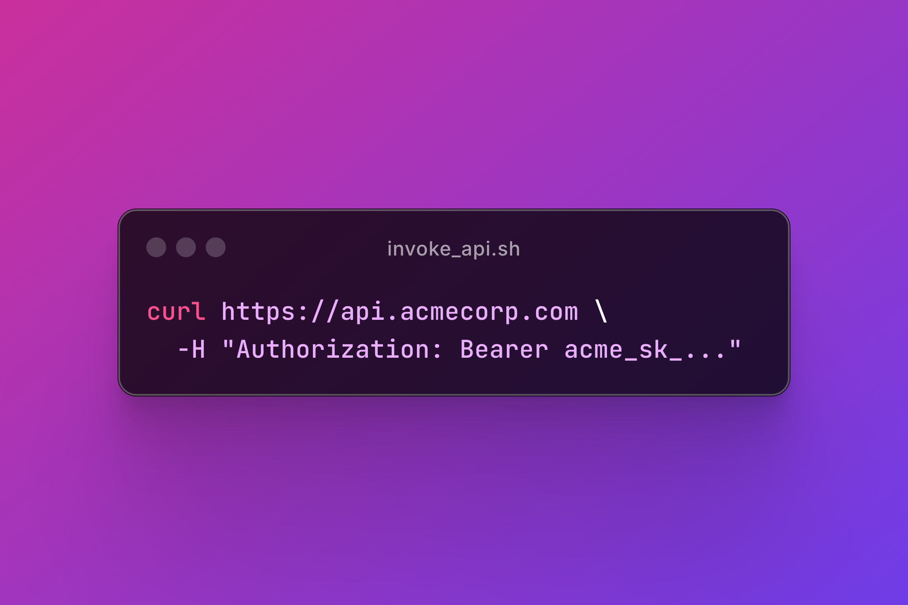

# Tesseral

Tesseral is **open source auth infrastructure for business software** (i.e., B2B
SaaS).

Tesseral is a multi-tenant, API-first service designed to run on the cloud. It
is not an authentication library tied to a particular language or framework;
Tesseral works with any tech stack.

Most developers should start by using Tesseral's managed service, available at
[console.tesseral.com](https://console.tesseral.com). You can also [self-host
Tesseral](https://tesseral.com/docs/features/self-hosting-tesseral).

## Key Features

Tesseral bundles everything that a developer needs to manage users in business software. 

|                                                                                                                                                                                                                                                                                                                                                                 |                                                   |
|----------------------------------------------------------------------------------------------------------------------------------------------------------------------------------------------------------------------------------------------------------------------------------------------------------------------------------------------------------------------------------|--------------------------------------------------------------------|
| [**Hosted, customizable login pages**](https://tesseral.com/docs/features/customizing-your-login-experience)<br /><br />Prebuilt UIs, customizable to your brand. Add and remove login methods with just a few clicks in the Tesseral Console.                                                                                                                                   | <tr></tr> |
| [**B2B multitenancy**](https://tesseral.com/docs/features/b2b-multitenancy)<br /><br />Tesseral is built for B2B SaaS. Your customer's admins control how their users log in to their tenant, and can add or remove users at will.                                                                                                                                               | <tr></tr>          |
| [**User impersonation**](https://tesseral.com/docs/features/user-impersonation)<br /><br />See exactly what your users see. Debug and support faster by logging in as your users.                                                                                                                                                                                                | <tr></tr>               |
| [**Self-service config for your customers**](https://tesseral.com/docs/features/self-serve-organization-settings)<br /><br />Pre-built settings pages where your customers can invite coworkers, edit their login settings, and everything else they need.                                                                                                                       | <tr></tr>                |
| [**Magic Links**](https://tesseral.com/docs/login-methods/primary-factors/log-in-with-email-magic-links)<br /><br />Add "Log in with Email" support using magic links, without writing any code.                                                                                                                                                                                 | <tr></tr>               |
| **Social Login**<br /><br />Add [Log in with Google](https://tesseral.com/docs/login-methods/primary-factors/log-in-with-google), [Log in with GitHub](https://tesseral.com/docs/login-methods/primary-factors/log-in-with-github), and [Log in with Microsoft](https://tesseral.com/docs/login-methods/primary-factors/log-in-with-microsoft) support without writing any code. | <tr></tr>              |
| [**SAML (Enterprise Single Sign-On)**](https://tesseral.com/docs/features/saml-sso)<br /><br />Add SAML support to your product without writing any code.                                                                                                                                                                                                                        | <tr></tr>                      |
| [**SCIM (Enterprise Directory Sync)**](https://tesseral.com/docs/features/scim-provisioning)<br /><br />Add SCIM support to your product without writing any code.                                                                                                                                                                                                               | <tr></tr>                      |
| [**Role-based access control (RBAC)**](https://tesseral.com/docs/features/role-based-access-control)<br /><br />Add fine-grained permissions to your product. The UI's done for you, just plug in `hasPermission` calls wherever you need them.                                                                                                                                  | <tr></tr>                      |
| [**Multi-factor authentication (MFA)**](https://tesseral.com/docs/features/multifactor-authentication-mfa)<br /><br />Add 2FA to your product without writing any code. Your customers can choose to require MFA for their users if they wish.                                                                                                                                   | <tr></tr>                       |
| [**Passkeys / WebAuthn**](https://tesseral.com/docs/login-methods/secondary-factors/login-with-passkey)<br /><br />Add "Log in with Passkey" support to your product without writing any code. Supports all passkey platforms, including Touch ID, Yubikeys, and more.                                                                                                           | <tr></tr>                  |
| [**Authenticator apps (TOTPs)**](https://tesseral.com/docs/login-methods/secondary-factors/login-with-authenticator-app)<br /><br />Add time-based one-time-password (TOTP) support to your product without writing any code.                                                                                                                                                    | <tr></tr>                      |
| [**API key management**](https://tesseral.com/docs/features/managed-api-keys)<br /><br />Not just user authentication. If you want your customers to call your endpoints automatically, give them API keys. UIs, permissions, and authentication checks all come pre-built.                                                                                                      | <tr></tr>                  |
| [**User invitations**](https://tesseral.com/docs/concepts/user-invites)<br /><br />Your users can invite their coworkers, or you can invite them yourself from the Tesseral Console.                                                                                                                                                                                             | <tr></tr>                   |
| [**Webhooks**](https://tesseral.com/docs/features/webhooks)<br /><br />Live-sync data from Tesseral into your database with realtime webhook delivery.                                                                                                                                                                                                                           | <tr></tr>                  |

## Get Started

### Read the documentation

We encourage all developers to read the full documentation first, which is
available at tesseral.com/docs. This README provides only a very brief subset of
the docs to illustrate some basic ideas.

### SDKs

Tesseral currently offers several SDKs for common web development frameworks.

* Clientside SDKs
  * [React](https://tesseral.com/docs/sdks/clientside-sdks/tesseral-sdk-react)
* Serverside SDKs
  * [Express](https://tesseral.com/docs/sdks/serverside-sdks/tesseral-sdk-express)
  * [Flask](https://tesseral.com/docs/sdks/serverside-sdks/tesseral-sdk-flask)
  * [Golang](https://tesseral.com/docs/sdks/serverside-sdks/tesseral-sdk-go)
  * [Rust (Axum)](https://tesseral.com/docs/sdks/serverside-sdks/tesseral-sdk-axum)

More SDKs, in particular Next.js, are in active development. If you do not see
your preferred framework listed here, please get in touch with
support@tesseral.com; we may be able to give you early access.

### Sign up

For Tesseral’s managed service, you will first need to create an account at
https://console.tesseral.com. 

You will need to create a Project and generate a Publishable Key. Publishable
Keys always look like this: `publishable_key_...`.

### Integrate your frontend

To integrate Tesseral into your app, you'll first need to integrate your
frontend. This example uses the [Tesseral React
SDK](https://tesseral.com/docs/sdks/clientside-sdks/tesseral-sdk-react).

Install the SDK like this:

```
npm install @tesseral/tesseral-react
```

Then, using your Publishable Key (starts with `publishable_key_...`), wrap your
React app in the `<TesseralProvider>` component:

```tsx
import { createRoot } from "react-dom/client"
import { TesseralProvider } from "@tesseral/tesseral-react";
import App from "./App.tsx"

const root = createRoot(document.getElementById("root")) 
root.render(
  // use your Project's Publishable Key here
  <TesseralProvider publishableKey="publishable_key_...">
    <App />
  </TesseralProvider>
)
```

The `<TesseralProvider>` will handle a variety of auth-related tasks for you,
including:

* Redirecting unauthenticated users to the login page ("login gating")
* Refreshing users' access tokens in the background when they're close to
  expiring 
* Automatically including access tokens in requests from your frontend
  to your backend

### Integrate your backend

Once you have your frontend integrated with Tesseral, you'll then need to
integrate your backend.

Tesseral works with any backend or framework. SDKs are available for the
following:

* [Express](https://tesseral.com/docs/sdks/serverside-sdks/tesseral-sdk-express)
* [Flask](https://tesseral.com/docs/sdks/serverside-sdks/tesseral-sdk-flask)
* [Golang](https://tesseral.com/docs/sdks/serverside-sdks/tesseral-sdk-go)
* [Rust (Axum)](https://tesseral.com/docs/sdks/serverside-sdks/tesseral-sdk-axum)

Your app might look something like this example, using the [Flask
SDK](https://tesseral.com/docs/sdks/serverside-sdks/tesseral-sdk-flask):

```python
from flask import Flask
from tesseral_flask import access_token_claims, require_auth


app = Flask(__name__)

# use the same Publishable Key you used for your frontend
app.before_request(require_auth(publishable_key="publishable_key_..."))


@app.route("/api/hello", methods=["GET"])
def hello():
    # get the user's email from the current request
    # Tesseral ensures that user emails are always verified
    email = access_token_claims().user.email
    return ("hello, " + email)


if __name__ == "__main__":
    app.run(debug=True, port=5050)
```

Tesseral's
[`require_auth()`](https://tesseral.com/docs/sdks/serverside-sdks/tesseral-sdk-flask#getting-started)
middleware (or its equivalent in your framework's SDK) validates access tokens
for you, and only authenticated requests will go through to your endpoint
handlers. A client can successfully `GET /api/hello` if and only if it has a
valid Tesseral access token.

You can extract out details about the requester using:

* [`organization_id()`](https://tesseral.com/docs/sdks/serverside-sdks/tesseral-sdk-flask#getting-the-current-organization)
* [`credentials()`](https://tesseral.com/docs/sdks/serverside-sdks/tesseral-sdk-flask#getting-the-requests-authenticated-credentials)
* [`access_token_claims()`](https://tesseral.com/docs/sdks/serverside-sdks/tesseral-sdk-flask#getting-details-about-the-current-user)
* [`has_permission()`](https://tesseral.com/docs/features/role-based-access-control#permission-checks)

Or their equivalent in your framework's SDK.

Once you have your backend integrated, you have implemented Tesseral!

## License

[MIT](./LICENSE).

## Contributing

We welcome outside contributions!

Please be aware, however, that auth software is complex and extremely delicate.
We are very cautious with the changes that we merge. We recommend you first open
a GitHub issue outlining any proposed changes.

## Security 

Please immediately report any potential vulnerabilities to
security@tesseral.com. We will get back to you over email.

Please do not open GitHub issues for any security-related concerns.

## Community

We love enterprise software and the people building it.

Please join our community and stay up to date on new releases, events, and other
Tesseral news by following us on
[LinkedIn](https://www.linkedin.com/company/tesseral) and on [X
(Twitter)](https://x.com/tesseralhq). You can also check out our
[newsletter](https://newsletter.tesseral.com/) and our
[blog](https://tesseral.com/blog).

You should also feel welcome to get in touch at founders@tesseral.com with
questions.

## Who we are

This is commercial open source software managed by Tesseral, a startup based in
San Francisco. We previously built
[SSOReady](https://github.com/ssoready/ssoready), an open source middleware for
SAML SSO and SCIM provisioning.

Primary technical responsibility for Tesseral belongs to [Ulysse
Carion](https://ucarion.com/), cofounder and CTO at Tesseral, and to Tesseral's
technical staff: [Blake Williams](https://github.com/blakeofwilliam) and [Dillon
Nys](https://github.com/dnys1).
